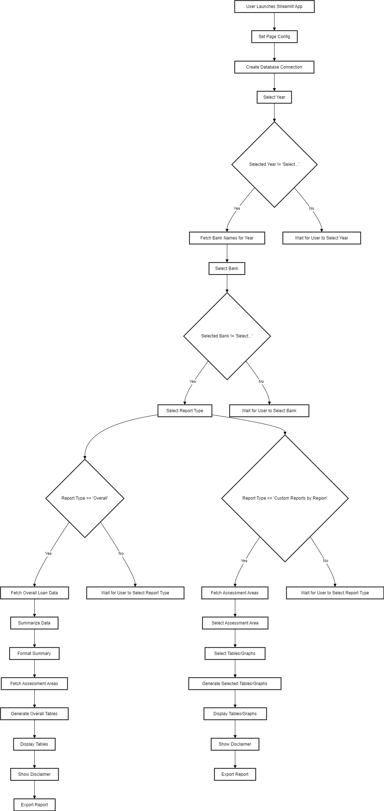

# CRA Analysis Application

Using a combination of SQL, Polars, Pandas, and Streamlit for presentation, this application is designed to parse and analyze information regarding Community Reinvestment Act (CRA) data provided by the Federal Reserve. The data can be found at [Federal Reserve CRA Data](https://www.federalreserve.gov/consumerscommunities/data_tables.htm).

## Functionality
The application is built with Streamlit and provides an interactive interface for analyzing the over 4GB of CRA data provided by the Federal Reserve. It allows users to select a financial institution and the year to request data from, and an HTML exportable report will be generated:


Additionally, for more fine grain detailsm Custom Reports can be generated divided up by the locations the selected institution had lending activity for that year. 


Options include:

- Loan Distribution Table
- Borrower Income Table
- Tract Income Table
- Business Tract Data
- Business Size Data
- Residential Demographics
- Business Demographics
- Assessment Area Distribution Table

The selected tables will then be displayed in Streamlit using Great Tables.


### Future Development
Planned features for future development include:

- Plotly intergration for graphs
- Custom reports with data from multiple lending locations
- Support for years before 2018 (changes in data collection methodology after 2018 would require multiple revisions to table code and calculations).
- and data after 2020 (limited by availability of data at this time).

#### Usage

Required Packages

The application requires the following Python packages:

- streamlit
- great_tables
- polars
- sqlalchemy
- pandas

You can install these packages using conda:

```bash
conda env create -f environment.yml
```

1. Download the data from https://www.federalreserve.gov/consumerscommunities/data_tables.htm. 

2. retail_loan_lending_test.csv and performance_evaluation_table.csv were used for this application.

3. Download MSA Tract data from https://www.ffiec.gov/. Click on MSA/MD state county tract crosswalk  to get the xlsx.

4. Put both these files in the data folder.

5. Run the csv_to_db.py to combine all of these into a db file to be used by the application. Take care to change chunk size based on computer resources. Current chunk size worked well with 8 cores, 16 threads, and 32GB of RAM. 

6. Open main.py. Run the streamlit app in terminal using streamlit run then adding the filepath to main.py.

7. In the opened web app, select the Year, Institution, and what kind of reports you want to see. At the bottom of the page, they can be exported to HTML for offline access.

##### Process Flow



###### Contribution
Contributions are welcome! Please feel free to submit a pull request or open an issue if you have any suggestions or find any bugs.

###### Disclaimer

The banking and financial data used in this report is sourced from the Federal Reserve.

Geographical data is sourced from the FFIEC.

There may be slight deviations in the data due to different fiscal year timings for individual banks and the Federal Reserve data is categorized by activity within the calendar year.

While every effort is made to ensure accuracy, please verify any critical information with official sources or consult a financial expert.
